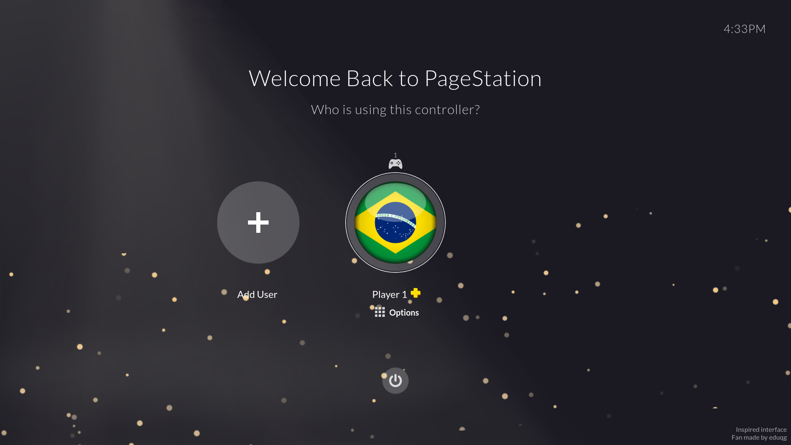
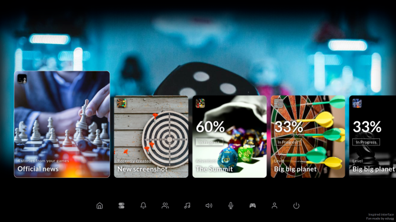
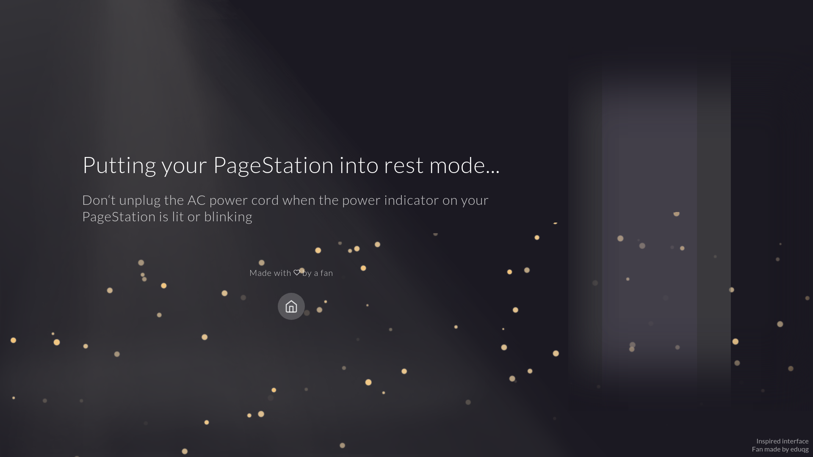
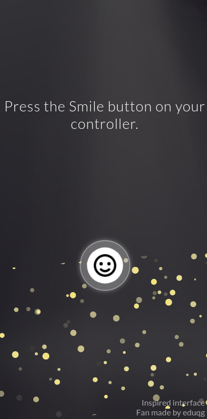
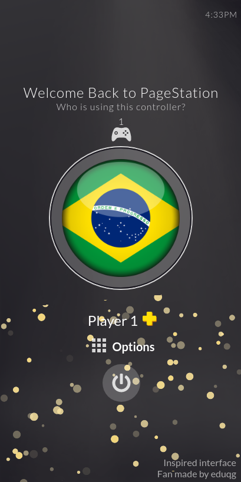
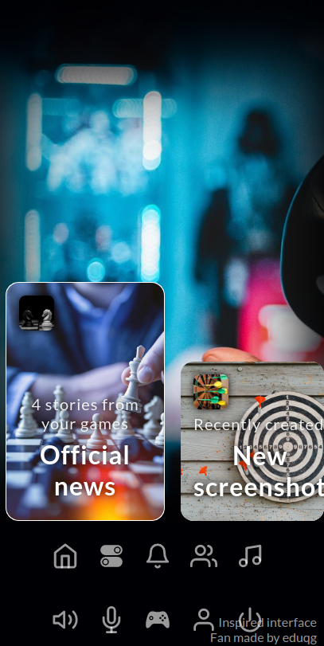
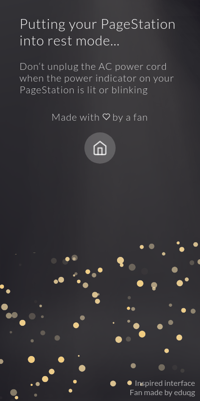

# Playstation 5 inpired UI with ReactJS

<p>
   
   
</p>

A Fan made interface inpired on PS5 new UI.

Developed with study purposes.

<a href="https://ps5-inspired-ui-reactjs.netlify.app/">Check out the Demo</a>

## Web

#### Start Page


#### Users Page



#### Home Page



#### Shutdown Page



## Responsive Mobile





## Getting Started

Clone this repository.

Install dependencies

```console
yarn
```

or

```console
npm install
```

Start the app

```console
yarn start
```

or

```console
npm run start
```

## Built With

- [React JS](https://reactjs.org/)

## What's next

- Buttons with diagonal shining

---

:wave: [Get in touch!](https://www.linkedin.com/in/eduardo-quintino/)

## License

This project is licensed under the MIT License
